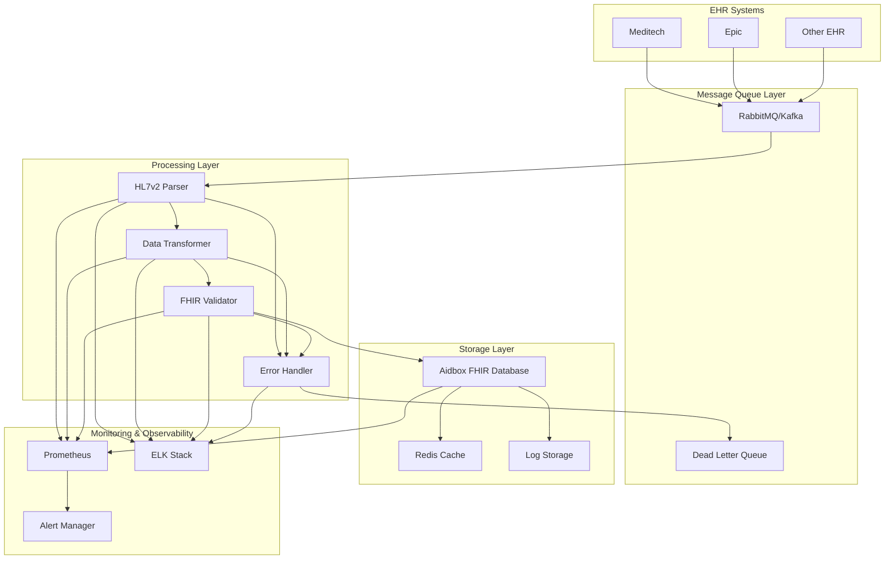

# Детальная архитектура HL7v2 to FHIR Pipeline

## Архитектурная диаграмма



## Детализация компонентов

### 1. Message Queue Layer

**RabbitMQ (начальная реализация):**
- Exchange: `hl7v2.messages`
- Queue: `hl7v2.processing`
- Dead Letter Queue: `hl7v2.dlq`
- Routing Key: `hl7v2.message`

**Apache Kafka (для масштабирования):**
- Topic: `hl7v2-messages`
- Partitions: 3 (по типам сообщений)
- Retention: 7 дней

### 2. HL7v2 Parser

**Функциональность:**
- Парсинг сегментов MSH, PID, PV1, OBR, OBX
- Валидация структуры сообщения
- Извлечение метаданных (timestamp, message type, etc.)
- Обработка escape-символов

**Обработка ошибок:**
- Невалидные сообщения → Dead Letter Queue
- Логирование ошибок парсинга
- Метрики качества данных

### 3. Data Transformer

**Маппинг HL7v2 → FHIR Patient:**

| HL7v2 Field | FHIR Patient Field | Notes |
|-------------|-------------------|-------|
| PID-3 (Patient ID) | identifier[0].value | Primary identifier |
| PID-5 (Patient Name) | name[0].given + family | Split into components |
| PID-7 (Date of Birth) | birthDate | ISO 8601 format |
| PID-8 (Sex) | gender | M/F → male/female |
| PID-11 (Address) | address[0] | Structured address |
| PID-13 (Phone) | telecom[0] | Contact information |

**Специальные случаи:**
- Обработка множественных идентификаторов
- Нормализация адресов
- Стандартизация телефонных номеров

### 4. FHIR Validator

**Валидация:**
- Схема FHIR R4
- Профили ресурсов
- Бизнес-правила
- Кросс-валидация ссылок

**Обработка ошибок:**
- Детальные сообщения об ошибках
- Автоматическое исправление простых ошибок
- Логирование проблем валидации

### 5. Aidbox Integration

**API Endpoints:**
- `POST /Patient` - создание пациента
- `PUT /Patient/{id}` - обновление пациента
- `GET /Patient/{id}` - получение пациента

**Обработка конфликтов:**
- Проверка существующих пациентов
- Merge стратегии для дублирующихся данных
- Версионирование ресурсов

## Поток данных

### 1. Входящий поток
```
EHR System → HL7v2 Message → Message Queue → Parser
```

### 2. Обработка
```
Parser → Extracted Data → Transformer → FHIR Resource → Validator
```

### 3. Сохранение
```
Validator → Valid FHIR → Aidbox → Success Response
Validator → Invalid FHIR → Error Handler → Dead Letter Queue
```

### 4. Мониторинг
```
All Components → Metrics → Prometheus → Grafana
All Components → Logs → ELK Stack → Kibana
```

## Масштабирование

### Горизонтальное масштабирование
- Множественные экземпляры парсера
- Партиционирование по типам сообщений
- Load balancing через message queue

### Вертикальное масштабирование
- Увеличение ресурсов для тяжелых операций
- Оптимизация алгоритмов парсинга
- Кэширование часто используемых данных

## Безопасность

### Аутентификация
- API ключи для Aidbox
- Сертификаты для EHR систем
- OAuth 2.0 для внешних API

### Шифрование
- TLS для всех соединений
- Шифрование данных в rest
- Безопасное хранение ключей

## Мониторинг и алерты

### Метрики
- Throughput (сообщений/сек)
- Latency (время обработки)
- Error rate (% ошибок)
- Queue depth

### Алерты
- Высокий error rate (>5%)
- Большая задержка (>1 час)
- Переполнение очередей
- Недоступность Aidbox
